Аутентификация и авторизация
===============================

*\~ В процессе разработки \~*

Главная страница 
====================

В случае успешной авторизации будет открыта главная страница сервиса:

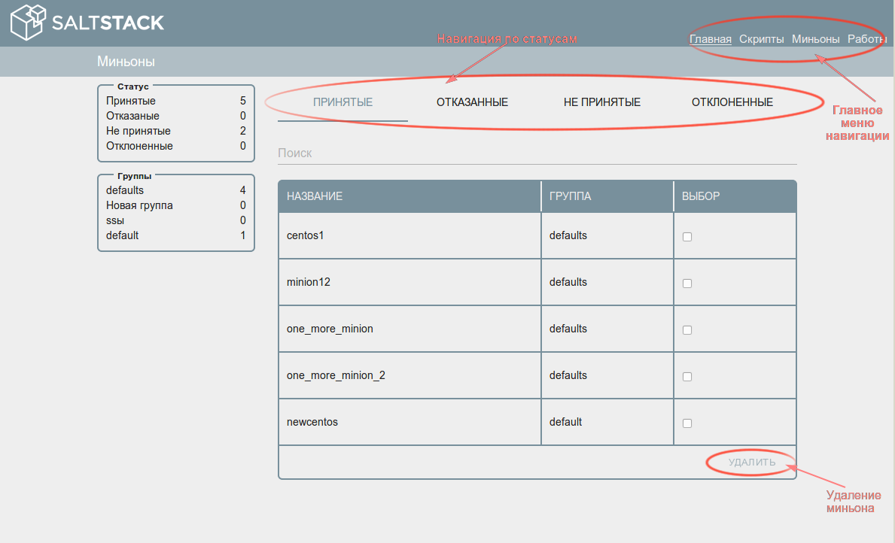

На главной странице отображается информация о миньонах, которые обратились к
серверу Salt.

Состояния миньонов делится на 4 типа: Принятый (Accepted), Отказанные (Denied),
Не принятые (Unaccepted), Отклоненные (Reject). Жизненный цикл миньона
предоставлен на рисунке 3.

В блоке «Статус» отображается общее количество миньонов, которые находятся в том
или ином состоянии.

В блоке «Группы» отображается общее количество принятых миньонов в каждой из
групп миньонов.

Во вкладке **«Принятые» (Acepted)** перечислены все принятые миньоны с
информацией о группах в которые они включены. Выполнение скриптов возможно
только у миньонов со статусом Accepted. Принятые миньоны можно удалить, отметив
один или несколько миньонов галочкой в поле «Выбор» и нажав на кнопку «Удалить»
(Delete) с подтверждением действия.

Вкладка **«Отказанные» (Deneid)** содержит перечень миньонов, которые отклонил
сам сервер Salt. В этот перечень попадают те миньоны, которые дублируют уже
принятых миньонов, например, название нового миньона совпадает с уже ранее
принятым миньоном.

Вкладка **«Не принятые» (Unaccepted)** содержит перечень новых миньонов, которые
обратились к северу Salt и прошли проверку на уникальность. Новые миньоны можно
принять для дальнейшей работы или отклонить, если это необходимо. При принятии
миньона обязательным является указание группы, которой будет принадлежать миньон
(подробнее о группах миньонов описано в разделе 3).

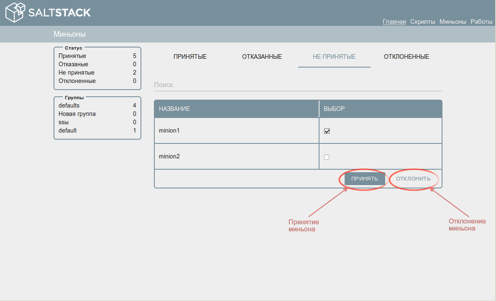

Во вкладке **«Отклоненные» (Rejected)** отображается весь перечень миньонов
когда-либо отклоненных пользователем. Миньона можно удалить аналогично, как и на
вкладке принятые.

Страница «Скрипты»
=====================

Управление скриптами — создание, редактирование, удаление, запуск на выполнение
возможно на странице «Скрипты».

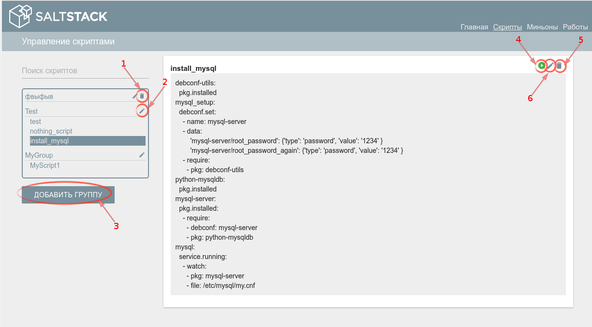

Навигация по странице:

1.  Удаление группы — функционал доступен только для группы, в которой не
    содержится ни одного скрипта;

2.  Редактирование наименования группы скриптов;

3.  Добавление группы и/или скрипта;

4.  Запуск скрипта на выполнение;

5.  Редактирование скрипта и принадлежность его к группе;

6.  Удаление скрипта.

Добавление скрипта
------------------

Скрипт обязательно должен содержаться в группе. Поэтому при создании нового
скрипта необходимо нажать на кнопку «Добавить группу» (кнопка 3 на рисунке 5).
После указать группу, в которой будет состоять скрипт (указать новую путем ввода
из клавиатуры или выбрать уже существующую с помощью выпадающего списка) (рис.
6). После нажать кнопку «Добавить скрипт» появится окно ввода наименования и
тела скрипта (рис. 7)

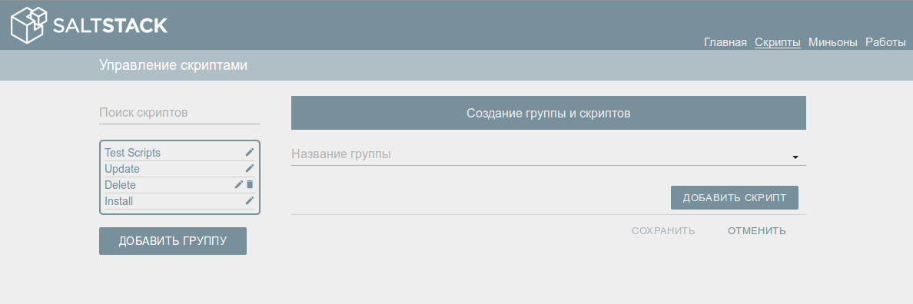

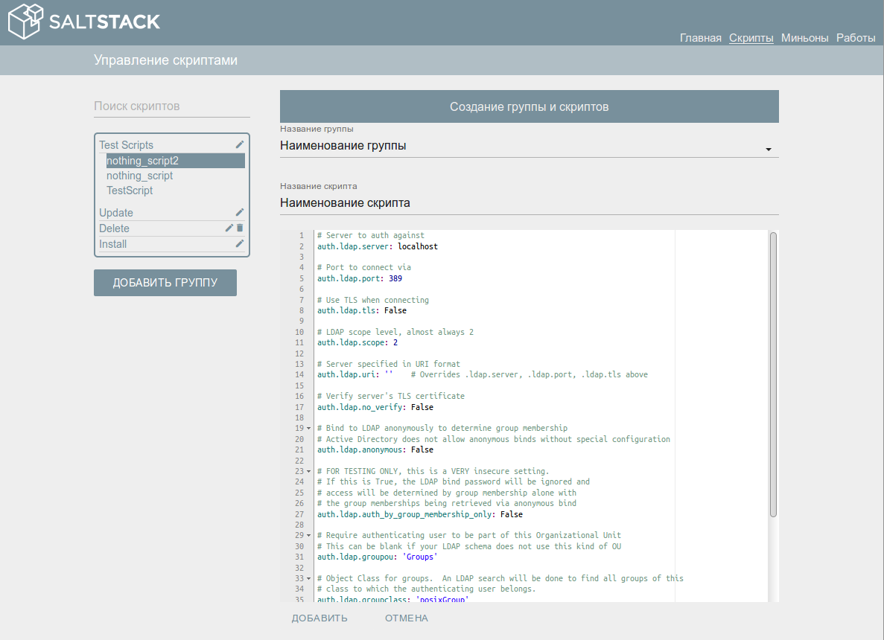

После нажатия на кнопку «Добавить» появится возможность добавление еще одного
скрипта в эту же группу. Если добавление скриптов окончено, то необходимо
сохранить все внесенные изменения нажатием на кнопку «СОХРАНИТЬ» (Рис. 8)

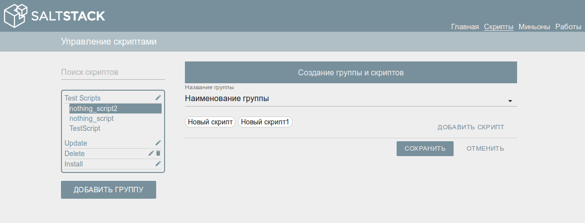

Запуск скрипта 
---------------

Из страницы «Скрипты» можно запустить один скрипт на нескольких миньонах. Для
этого необходимо нажать на кнопку «Запустить» (рис. 5 кнопка 6) выбрать один или
несколько миньонов и еще раз нажать кнопку «Запустить»

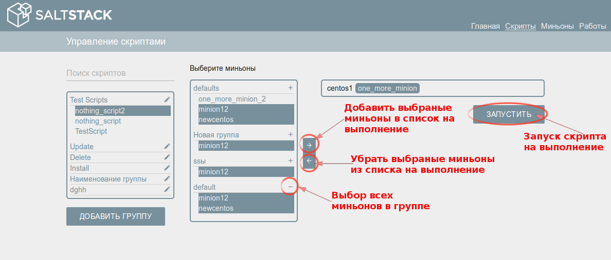

Результаты выполнения скрипта описаны в разделе 5.

Страница «Миньоны»
=====================

Подробную информацию о миньонах и принадлежность их к группам можно посмотреть
на странице «Миньоны». Один миньон может принадлежать нескольким группам.

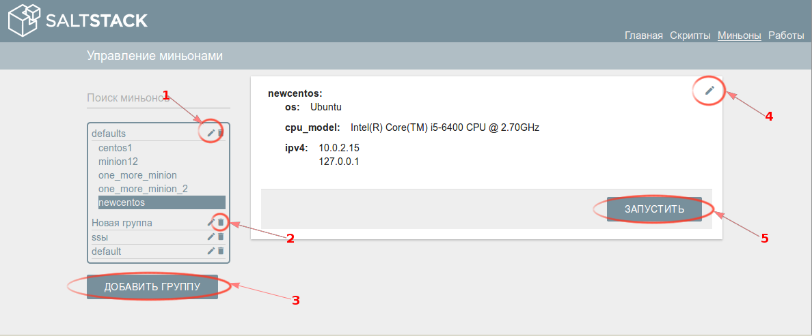

Доступная функциональность на странице:

1.  Редактирование имени группы миньонов;

2.  Удаление группы миньонов. После удаления группы миньоны, которые были только
    в этой группе автоматически переместятся в группу по умолчанию;

3.  Добавление группы миньонов

4.  Редактирование принадлежности миньона к группам (рис. 11);

5.  Запуск нескольких скриптов для выбранного миньона.

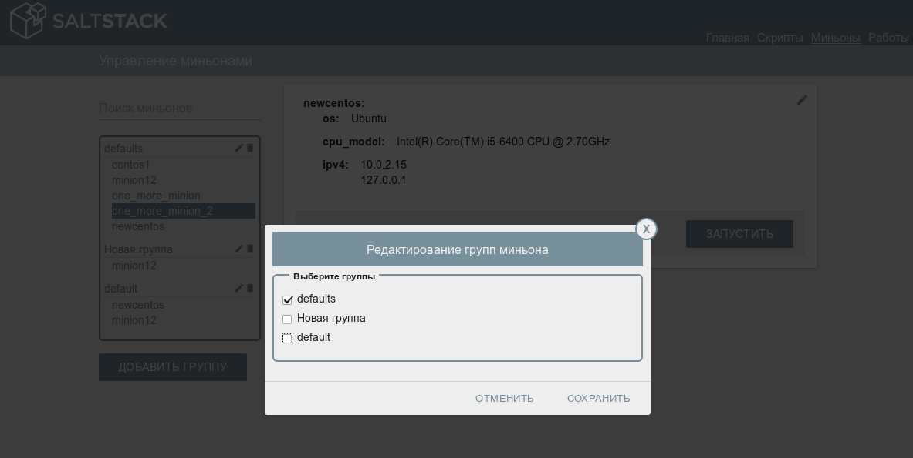

Запуск скрипта
--------------

Запуск скрипта из страницы «Миньоны» аналогичен функциональности из страницы
«Скрипты», только с той разницей что выбираются скрипты (один или несколько) для
запуска на одном миньоне.

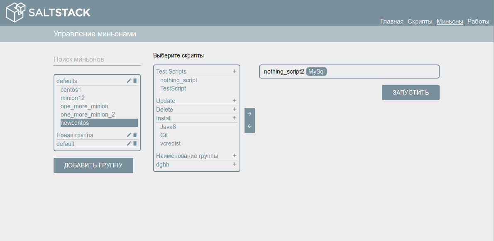

Страница «Работы»
====================

Результаты выполнения запущенных скриптов можно посмотреть на странице «Работы»
- рисунок 13

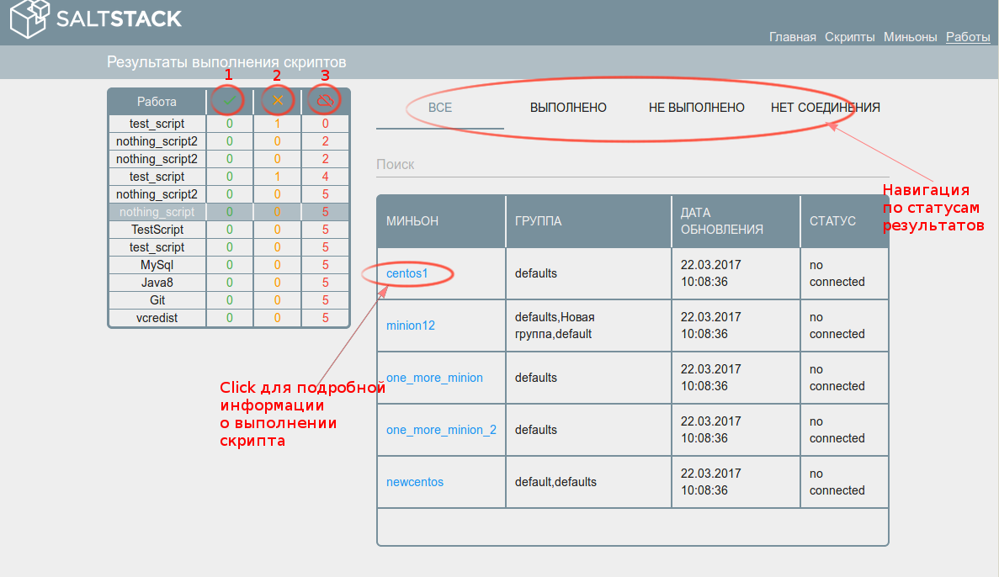

В левой части экрана отображается список запущенных ранее скриптов с
аккумулированными результатами по выполнению:

1.  Выполнено;

2.  Не выполнено;

3.  Нет связи с миньоном.

Подробную информацию о ходе выполнения скрипта на конкретном миньоне можно
посмотреть, кликнув на имя миньона (рис. 14).

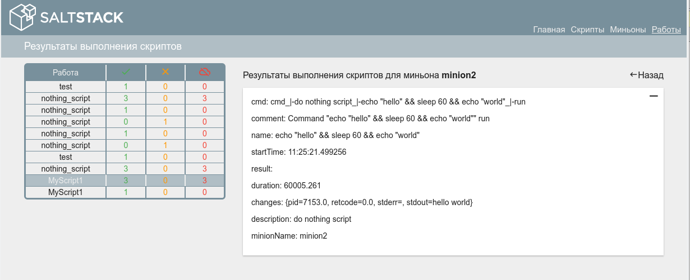

На вкладках «Не выполнено» и «Нет соединения» предусмотрена функциональность
перезапуска скрипта на тех миньонах на которых скрипт не выполнился (рис. 15 и
16)

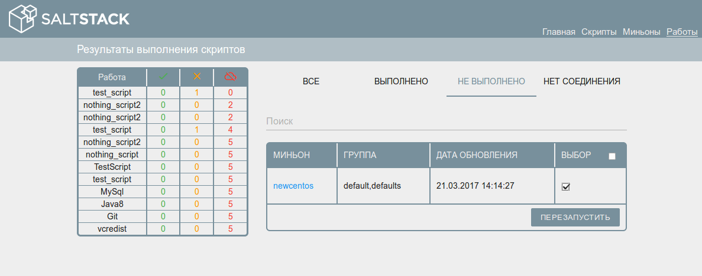

