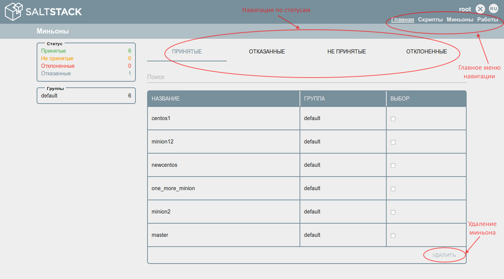
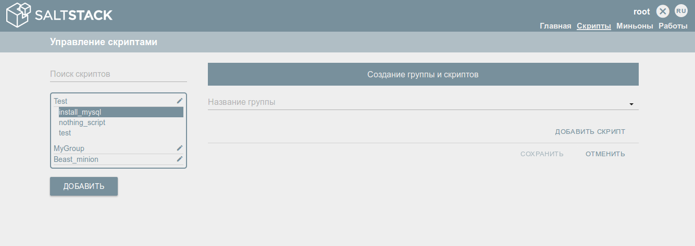

**Инструкция пользователя SaltGUI**
============================

Аутентификация и авторизация
============================

Приступая к работе с SaltGUI, необходимо пройти процедуру авторизации. Для этого
в появившемся окне авторизации необходимо ввести имя пользователя и пароль,
после чего нажать кнопку «АВТОРИЗОВАТЬСЯ» (Рис. 1).

В том случае, когда имя пользователя и пароль были введены не верно, в нижней
части окна авторизации появится соответствующее уведомление (Рис. 2).

При успешной авторизации будет выполнен переход на главную страницу.

Главная страница
================

В случае успешной авторизации будет открыта главная страница сервиса:

На главной странице отображается информация о миньонах, которые обратились к
серверу Salt.

Состояния миньонов делится на 4 типа: Принятый (Accepted), Отказанные (Denied),
Не принятые (Unaccepted), Отклоненные (Reject). Жизненный цикл миньона
предоставлен на рисунке 4.

В блоке «Статус» отображается общее количество миньонов, которые находятся в том
или ином состоянии.

В блоке «Группы» отображается общее количество принятых миньонов в каждой из
групп миньонов.

Во вкладке **«Принятые» (Acepted)** перечислены все принятые миньоны с
информацией о группах в которые они включены. Выполнение скриптов возможно
только у миньонов со статусом Accepted. Принятые миньоны можно удалить, отметив
один или несколько миньонов галочкой в поле «Выбор» и нажав на кнопку «Удалить»
(Delete) с подтверждением действия.

Вкладка **«Отказанные» (Deneid)** содержит перечень миньонов, которые отклонил
сам сервер Salt. В этот перечень попадают те миньоны, которые дублируют уже
принятых миньонов, например, название нового миньона совпадает с уже ранее
принятым миньоном.

Вкладка **«Не принятые» (Unaccepted)** содержит перечень новых миньонов, которые
обратились к северу Salt и прошли проверку на уникальность. Новые миньоны можно
принять для дальнейшей работы или отклонить, если это необходимо. При принятии
миньона обязательным является указание группы, которой будет принадлежать миньон
(подробнее о группах миньонов описано в разделе 3).

Каждый принятый миньон должен состоять хотя бы в одной группе миньонов, поэтому
после нажатия на кнопку «Принять» появится диалоговое окно выбора группы
принадлежания миньона. Один миньон может состоять в нескольких группах, это
предусмотрено для удобвства работы и выбора миньонов при запуске скриптов
(подробнее в разделе «Скрипты»)

Во вкладке **«Отклоненные» (Rejected)** отображается весь перечень миньонов
когда-либо отклоненных пользователем. Миньона можно удалить аналогично, как и на
вкладке принятые.

Страница «Скрипты»
==================

Управление скриптами — создание, редактирование, удаление, запуск на выполнение
возможно на странице «Скрипты».

Навигация по странице:

1.  Редактирование наименования группы скриптов;

2.  Удаление группы — функционал доступен только для группы, в которой не
    содержится ни одного скрипта;

3.  Добавление группы и/или скрипта;

4.  Запуск скрипта на выполнение;

5.  Редактирование скрипта и принадлежность его к группе;

6.  Удаление скрипта.

Добавление скрипта
------------------

Скрипт обязательно должен содержаться в группе. Поэтому при создании нового
скрипта необходимо нажать на кнопку «Добавить группу» (кнопка 3 на рисунке 7).
После указать группу, в которой будет состоять скрипт (указать новую путем ввода
из клавиатуры или выбрать уже существующую с помощью выпадающего списка) (рис.
8). После нажать кнопку «Добавить скрипт» появится окно ввода наименования и
тела скрипта (рис. 9)

После нажатия на кнопку «Добавить» появится возможность добавление еще одного
скрипта в эту же группу. Если добавление скриптов окончено, то необходимо
сохранить все внесенные изменения нажатием на кнопку «СОХРАНИТЬ» (Рис. 10)

Запуск скрипта
--------------

Из страницы «Скрипты» можно запустить один скрипт на нескольких миньонах. Для
этого необходимо нажать на кнопку «Запустить» (рис. 7 кнопка 6) выбрать один или
несколько миньонов и еще раз нажать кнопку «Запустить»

Результаты выполнения скрипта описаны в разделе 5.

Страница «Миньоны»
==================

Подробную информацию о миньонах и принадлежность их к группам можно посмотреть
на странице «Миньоны». Один миньон может принадлежать нескольким группам.

Доступная функциональность на странице:

1.  Редактирование имени группы миньонов;

2.  Удаление группы миньонов. После удаления группы миньоны, которые были только
    в этой группе автоматически переместятся в группу по умолчанию;

3.  Добавление группы миньонов

4.  Запуск нескольких скриптов для выбранного миньона;

5.  Редактирование принадлежности миньона к группам (рис. 13).

Запуск скрипта
--------------

Запуск скрипта из страницы «Миньоны» аналогичен функциональности из страницы
«Скрипты», только с той разницей что выбираются скрипты (один или несколько) для
запуска на одном миньоне.

Страница «Работы»
=================

Результаты выполнения запущенных скриптов можно посмотреть на странице «Работы»
- рисунок 15

В левой части экрана отображается список запущенных ранее скриптов с
аккумулированными результатами по выполнению:

1.  Выполнено;

2.  Не выполнено;

3.  Нет связи с миньоном;

4.  Ожидают выполнения.

По умолчанию этот список содержит все скрипты запущенные за последние 2 часа,
если необходимо посмотреть результаты скриптов запущенных ранее, то нужно
выбрать в фильтре необходимый диапазон (рис. 16)

Подробную информацию о ходе выполнения скрипта на миньоне можно посмотреть,
кликнув на ссылку «(logo)», находящеюсь рядом с именем миньйона (рис. 17).

На вкладках «Не выполнено» и «Нет соединения» предусмотрена функциональность
перезапуска скрипта на тех миньонах на которых скрипт не выполнился (рис. 18 и
19)

